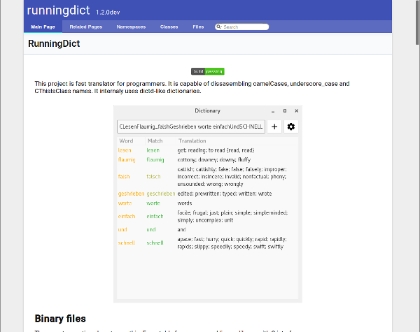
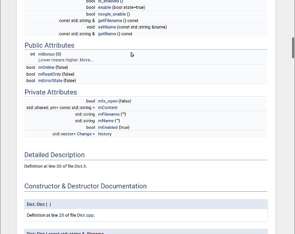

# Empty doxygen CMake subproject

## Screenshots

### Markdown main page



### Doxgen generated API documentation



## Use in your project

~~~
cd yourproject
git clone EmptyDoxygenCMake doc
rm -rf doc/.git
~~~

Edit `doc/doxygen/Doxyfile.in` *INPUT* and *STRIP_FROM_PATH* to fit your
project. Also you can change where the documentation will be installed in
`doc/CMakeLists.txt` in the first *#TODO* section. If you do not want
your documentation to be part of installation, just leave the section 
commented.

To your main CMakeLists.txt you want to add `add_subdirectory(doc)` in order to
include documentation build.

## Standalone doc builder

Sometimes you just need to build docs from some pile of sources, and here can
this repository help you. You may not even have a CMake Project setup yet, in
this case you need to uncomment code after second *#TODO* section in
`doc/CMakeLists.txt` and documentation will act as a standalone CMake project.

### Prerequisites

* CMake 3.2 and newer
* C++14 capable compiler
* Doxygen for docs (*Graphviz for more graphs in docs, PlantUML for more UML diagrams*, PlantUML needs java)

#### Linux
* Arch Linux: `sudo pacman -S cmake g++ graphviz git`
    * download plantuml.jar and have it somewhere where *PATH* points to

* Ubuntu 16.04: `sudo apt-get install cmake g++ graphviz plantuml git`

#### Windows

* Install msys2 and install these packages:
    * `mingw32/mingw-w64-i686-gcc mingw32/mingw-w64-i686-cmake git mingw32/mingw-w64-i686-make msys/make msys/doxygen msys/make`
* For graphs in documentation install Graphviz (to `c:\Program Files\Graphviz`, so scripts can find it) and add its `bin` subdirectory to *PATH*, install java (have it on *PATH*), download PlantUML jar file and have it on *PATH*.


## Building doc

You can use *doc* target to build and *install* target to install the
documentation (if installation part of CMakeLists.txt is uncommented).

Documentation will be in your `[build_directory]/doc/index.html` or
`[build_directory]/doc/doc/index.html` depending of whether used as 
standalone or as a CMake subdirectory.

### Linux

```
mkdir build
cmake ../path/to/CMake/directory/
make doc
```

### Windows

```
mkdir build
cmake ../path/to/CMake/directory/ -G "MSYS Makefiles"
make doc
```


